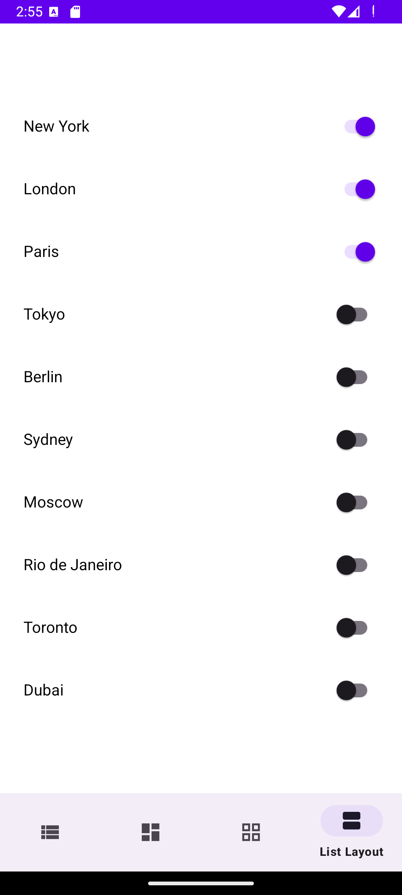

# UIShowcaseApp

UIShowcaseApp is a multi-page Android application demonstrating various UI components and layouts in Android. It includes examples of **LinearLayout**, **ConstraintLayout**, **GridLayout**, and **RecyclerView**. The app also features **dark mode support** and **localization** for **English**, **Canadian French**, and **Brazilian Portuguese**.

## Features

- **Page 1: LinearLayout Demo**
  - Includes a `TextView`, `EditText`, `Button`, and `ImageView`.
  - Displays a toast message on button click.

- **Page 2: ConstraintLayout Demo**
  - Includes a `SwitchCompat`, `ProgressBar`, and `FloatingActionButton (FAB)`.
  - Switch toggles the visibility of the ProgressBar, and FAB shows a Snackbar.

- **Page 3: GridLayout Demo**
  - Displays 6 items in a grid with icons and text.
  - Clicking an item shows a toast message with the item's name.

- **Page 4: RecyclerView Demo**
  - Displays a list of cities with a toggle switch for each item.
  - Clicking a switch shows a toast message with the city's status.

## Additional Features

- **Dark Mode**: Custom themes for both light and dark modes.
- **Localization**: Supports English (default), French (Canada), and Portuguese (Brazil).

## Screenshots

### Day Theme - Vertical

<div style="display: flex; flex-wrap: wrap; gap: 10px;">

  

  

  

  

</div>

### Night Theme - Horizontal

<div style="display: flex; flex-wrap: wrap; gap: 10px;">

  

  

  

  

</div>

## Installation

1. Clone the repository:
   ```bash
   git clone https://github.com/yourusername/UIShowcaseApp.git
   
2. Open the project in Android Studio.
   
4. Build and run the app on an Android emulator or device.

## License
This project is licensed under the MIT License. See the LICENSE file for more details.

